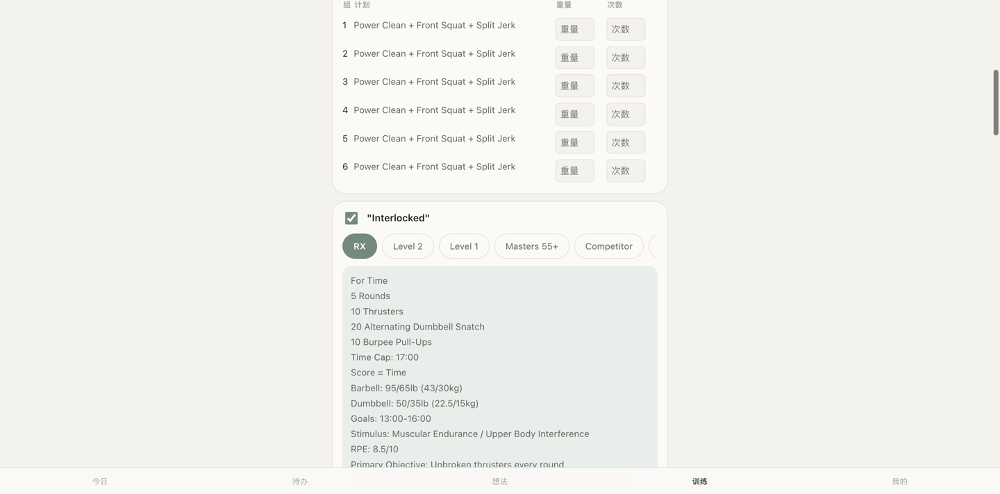
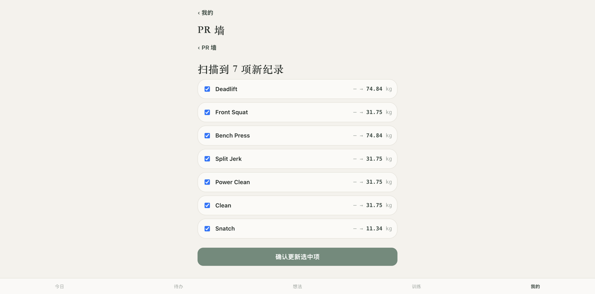
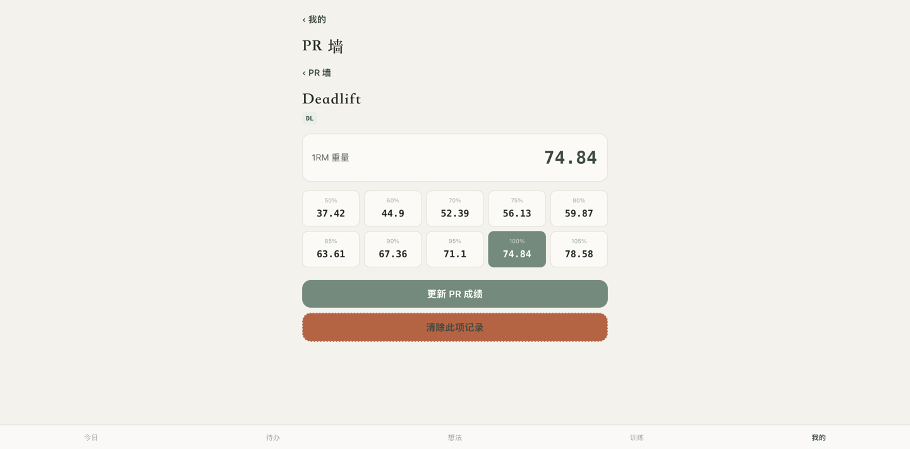
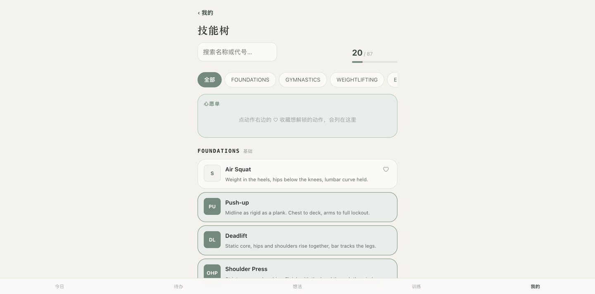
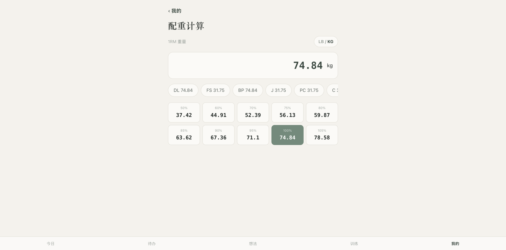

# handoff

A training-log and gym-schedule app for a small CrossFit box. The day's workout
shows up automatically instead of needing to be retyped by hand, and the app layers
on training-log history, a PR tracker, a skill-progression tree, and a couple of
small tools (plate-loading calculator, interval timer).

**Live**: [handoff-web.irisssaq.workers.dev](https://handoff-web.irisssaq.workers.dev)
(see "Access" below for why there's no public demo account).

## Architecture

```
┌─────────────┐     ┌──────────────────────┐     ┌────────────┐
│  web/        │────▶│  api/ (Cloudflare    │────▶│  Supabase  │
│  static SPA  │     │  Python Worker)      │     │  (Postgres │
│  (no build   │◀────│  FastAPI, Pyodide    │◀────│   + Auth)  │
│   step)      │     │  sandbox             │     └────────────┘
└─────────────┘     └──────────────────────┘
                              ▲
                              │ POST /api/wod/ingest
                              │ (bearer token, no user auth)
                     ┌──────────────────┐
                     │  api-wodify/      │
                     │  read-only sync   │
                     │  client (runs on  │
                     │  a cloud VM,      │
                     │  weekly cron)     │
                     └──────────────────┘
```

- **`web/`** — plain ES modules, no framework, no bundler. Deployed as a Cloudflare
  Workers static-assets project. Talks to Supabase directly for user data (protected
  by row-level security), and to the `api/` Worker only for the one endpoint that
  needs a server-held secret.
- **`api/`** — a FastAPI app running on Cloudflare's Python Workers (via Pyodide).
  The FastAPI app itself (`entry.py`) is plain and unit-testable; the Workers glue
  code (`worker.py`) that imports Pyodide-only modules is a thin, separately-tested
  shim. Holds the Supabase service-role key and does hand-rolled HS256 JWT
  verification for the one endpoint that needs it — Pyodide's sandbox rules out
  most JWT libraries as runtime dependencies, so it's ~30 lines of stdlib
  `hmac`/`hashlib` instead of a package.
- **`api-wodify/`** — a read-only client that keeps the shared workout table up
  to date on a schedule, so nobody has to retype the day's workout by hand.
  Split into a rarely-run setup step and a lightweight query step that does the
  actual weekly refresh with no browser involved, so the always-on side of it is
  just a scheduled job — no persistent heavyweight process. Scoped to read one
  thing only (that day's workout content) and nothing about other members.
- **Supabase** — Postgres + Auth (Google / magic-link email) + row-level security.
  Personal data (todos, training log, PRs, skill unlocks) is scoped per-user by
  RLS; the shared workout-of-the-day table is readable by any authenticated member.

## Some things worth pointing out

- **A well-tested parser layer**, with regression tests added *after* finding
  actual bugs against live data rather than only against synthetic fixtures —
  see `api-wodify/src/wodify/parse.py`'s module docstring for the specific traps
  (trusting a vendor's own type flags over keyword-guessing, a type flag not
  being a reliable section-boundary signal on its own, etc.).
- **A from-scratch auth boundary**: the ingest endpoint that the sync client posts
  to authenticates with a single shared token (`hmac.compare_digest`, constant-time),
  completely separate from the user-facing JWT auth path — so a compromised sync
  token can pollute the shared workout table at worst, never touch user data.
- **Alerting, not just logging**: an independent Cloudflare Cron Trigger checks
  daily that fresh data actually landed, and the sync client itself reports its own
  failures — both paths converge on one `send_alert()` function so there's a single
  place that knows how to notify a human, not three copy-pasted ones.
- **No ORM, no build step, no framework on the frontend** — deliberately. This is a
  small app for a few dozen people; a framework and a build pipeline would be
  net negative complexity here. All plain ES modules, loaded natively by the
  browser.

## Screenshots

**Workout auto-imported from the gym's platform**, split into per-set weight/reps
entry, with difficulty-level tabs pulled straight from the source data (RX /
Level 1 / Level 2 / Masters 55+ / Competitor here — not hardcoded, however many
levels a given day's workout actually has):



**PR tracker**, scanning training-log history to surface new personal records
automatically instead of requiring manual entry:



Once set, a PR drives a %-based loading table — just percentages rounded to two
decimals, deliberately not a plate-math breakdown (an earlier version tried
rounding to loadable plates and it made the numbers harder to trust, not easier):



**Skill-progression tree** (87 movements, CrossFit-style 2–4 letter codes),
no unlock gating — any movement can be marked done at any time:



Plus a couple of small tools (plate-loading calculator shown; there's also an
interval timer) that reuse the same PR data:



## Access

The gym's booking platform is a paid product, and the workout content pulled from
it belongs to the gym/its coaches, not to me — so sign-ups are restricted to
actual members rather than open to the public. Screenshots above cover the main
flows; happy to walk through the live app on a call instead of a public demo
account.

## Roadmap

- **Loading recommendations** — suggest next session's working weight from
  training-log history. Designed (not yet built) as a hybrid: the actual number
  comes from a deterministic rule over past loads and completion, while an LLM
  only ever touches the *reasoning text* shown alongside it (folding in how a
  session felt, not just what was lifted) — the suggestion itself has to stay
  explainable, not a black box.
- **Class recommendations** — suggest which upcoming class to book based on
  recent training patterns (movements trained/avoided recently, time-of-day
  preference).
- Public leaderboards (opt-in per movement).

## Stack

Cloudflare Workers (Python + static assets) · FastAPI · Supabase (Postgres, Auth,
Row-Level Security) · pytest · ruff
